**Total time spent on project: 96 hours**

---

## Daily Logs

### 2025-06-17  
**Hours spent:** 6  
The beginning of the Nocti-Care project consisted of early developing a simplistic idea of the wearable itself. This vision was a soft light weight wristband that may be worn over a night without causing an inconvenience. I delved deep into scholarly and technical articles about sleep monitoring technologies and narrowed the possible sensor types to include GSR to detect stress, HRM to detect heart rate and a gyroscope to count motion. I also developed system block diagram to picture how the data would move through these sensors, through the processor, to the cloud and finally to the phone belonging to the user.

- 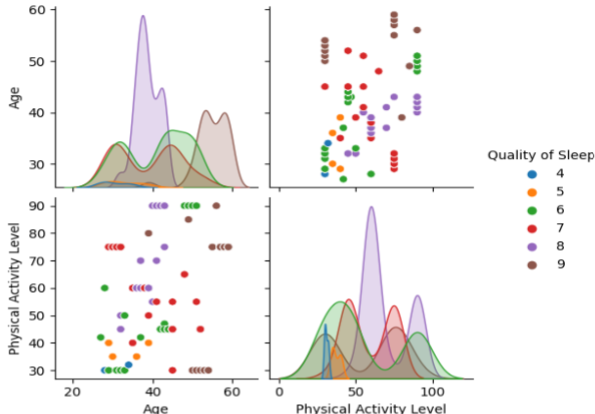

---

### 2025-06-18  
**Hours spent:** 5  
Selecting sensors occupied the stage agenda today. I compared several GSR modules and selected one that had decent documentation sufficient to understand how to use it and sensitivity but not too sensitive as to be unreliable. I also settled on the selection of the gyroscope (MPU6050) and a small HRM unit. I designed the first schematic with the aid of Fritzing to be ready to bread board it. This was a visual guide of how the wiring could have functioned on the initial prototype and therefore I could easily predict it.

---

### 2025-06-19  
**Hours spent:** 4  
I created the initial working prototype on a breadboard with an Arduino UNO, the GSR sensor and the MPU6050. The connection was quite simple, and I managed to watch raw data pass through the serial monitor. The GSR readings were jumpy and the gyroscope was smooth. I noted that I have to write a smoothing filter in the firmware to filter the signals.

---

### 2025-06-20  
**Hours spent:** 6  
I did mostly firmware today. I created a simple loop which permitted intersection between the three sensors. I averaged the readings of the GSR to cancel unruly fluctuations with a simple averaging algorithm. Afterwards, I connected the ESP8266 Wi-Fi by using software serial and was able to connect it to firebase. The feeling of progress was real enough - the system was already online, however primitive it still was.
- 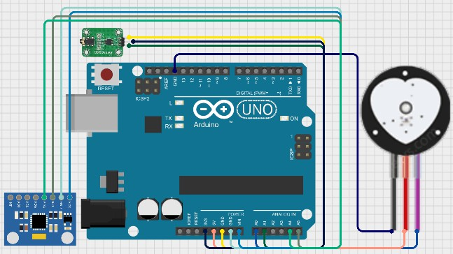

---

### 2025-06-21  
**Hours spent:** 5  
Today I switched to the physical design and began 3d modeling the wristband. I cut holes and fitted mounting holes on OLED screen, batteries and sensor contact zones so they could peep straight through the skin. The three tries were done to reach to a comfortable and ergonomic fit. Every variation was a few steps toward what people could possibly wear in a night.
- 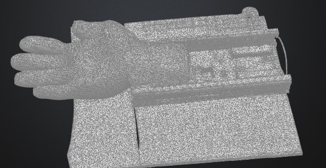   

---

### 2025-06-22  
**Hours spent:** 4  
I also wanted to ensure the reliability of the heart rate sensor, and I, therefore, provided a dummy signal simulating BPM input and checked the way the system performed. I also incorporated added timestamping through a real-time clock module to synchronise readings to be processed later. I made all the values redundant by routing them to a micro SD card well this would later come in handy in case the Wi-Fi dropped.

---

### 2025-06-23  
**Hours spent:** 5  
I plugged in a 0.96 OLED screen over I2C and wrote the screen to display live GSR and heart rate. I started to create a basic user interface interface- displaying status icons such as: sleep mode and a duration progress bar. I also included a small buzzer module which was also capable to sound out in the event of wake-up or anomalous sensorreadings.

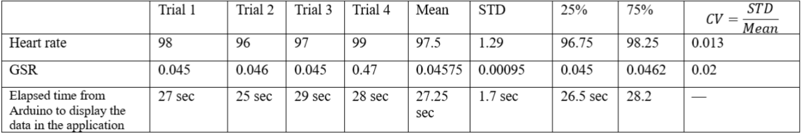

---

### 2025-06-24  
**Hours spent:** 6  
The big topic today was cloud integration. I was trying to work on the upload of structured data to firebase on the device and even testing MQTT as a second alternative protocol. I built a simple JSON with the structure that would store nightly readings per user and be ready to process in machine learning once it will be available.

---

### 2025-06-25  
**Hours spent:** 5  
Today I started the work on the machine learning side of the system. I implemented a generation of a dataset according to the previous trends in a historical dataset and trained a version of a decision tree classifier on Python. The idea was to identify quality sleep and marker of stress. I was able to make custom suggestions and pipe them into the device via its headphone output the first look at the adaptive feedback loop I realized Nocti-Care had.

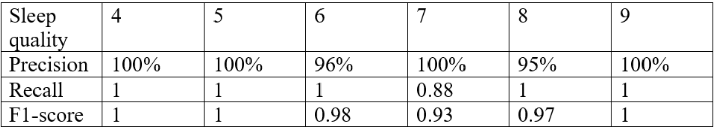

---

### 2025-06-26  
**Hours spent:** 4  
I connected firebase to a prototype mobile application that I developed using Flutter. It showed real-time sensor sensors and pointed out any irregular BPM or too much activity at night. Seeing the data from the wearable represented in such a clean visual was satisfying, but perhaps more notable was the fact that it was in a visual format that an end user could hopefully glean insight into immediately.

---

### 2025-06-27  
**Hours spent:** 5  
Still more modifications now. In the 3D model, I improved the feeling around the wrist by smoothing down the edges of the enclosure and added a battery clip so that the insides could be kept attached. I modelled internal heat build up to detect hot spots and point at ventilation. I selected TPU material as the strap, since the material is supple, and ABS as the housing, since this material can offer durability without bulky-ness.

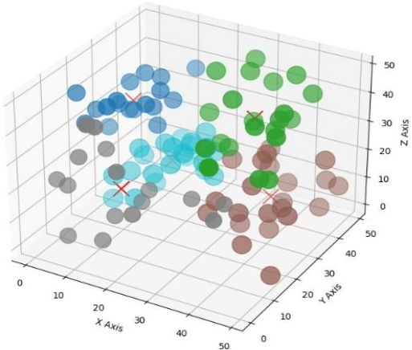

---

### 2025-06-28  
**Hours spent:** 5  
That day was power regulation. I used an AMS1117 regulator to reduce the Li-ion battery voltage at 3.3V level ensuring that the ESP8266 and other sensors were not destroyed. A TP4056 charging module also was wired in, and USB based recharging was tested.

---

### 2025-06-29  
**Hours spent:** 6  
Today the game was called stress-testing. When both the OLED and Wi-Fi module was drawing substantially, I observed a power brownout condensed at that time. I added a capacitor to smooth the power draw to correct it. I tested the system again (this time in a controlled sleep simulation) after that, and all was stable.

---

### 2025-06-30  
**Hours spent:** 4  
My specialization involved organizing of all assets of the project. I sorted, and cataloged the 3D models, sensor spec sheets, and technical materials. To take high res images of the device and prototype stages too at the end, because they were to feature in documentation and gallery.
- 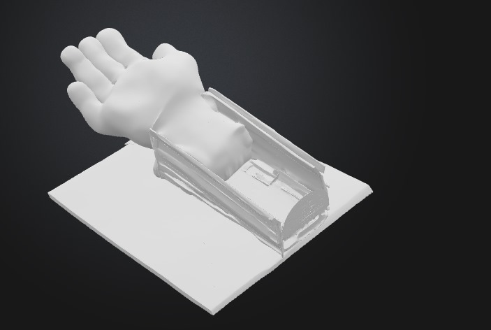
- 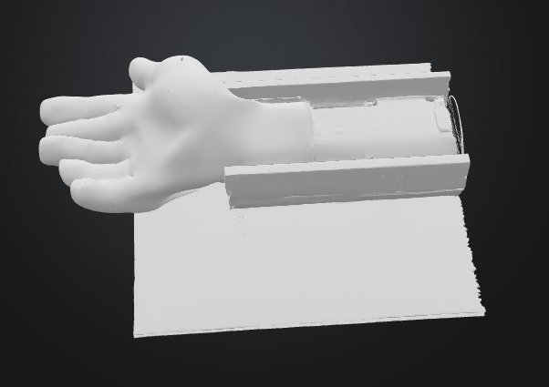

---

### 2025-07-01  
**Hours spent:** 6  
I completed the README structure, so there were no gaps: I discussed a purpose, system overview, diagrams, and visuals. I, also, formed a BOM of Materials (BOM) with correct links and prices. I also went through references to ensure that anybody could repeat the project.
- 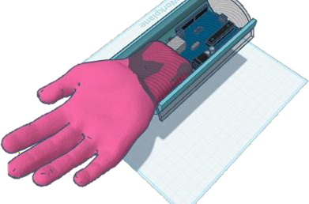

-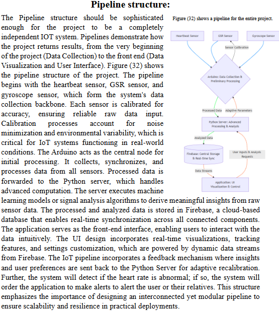

---

### 2025-07-02  
**Hours spent:** 8  
Among the more agonizing days. I made test simulations of the sleep patterns with sleepless nights, erratic breathing, and tossing about to find the response that the system could give. I optimized the motion threshold, stress detection thresholds on the firmware. Then I powered it fully up and left it running a full eight hours to see that the long-term data integrity and power stability were maintained.

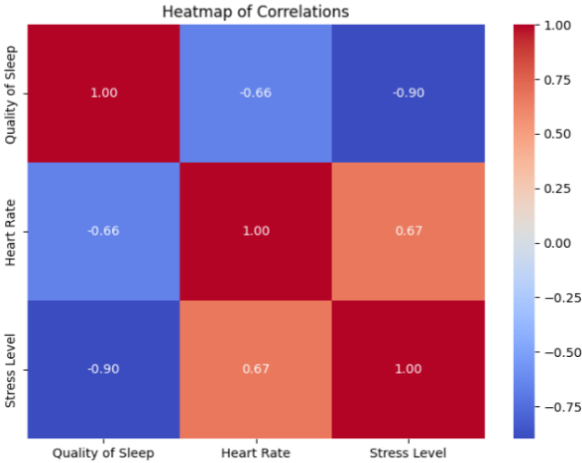  
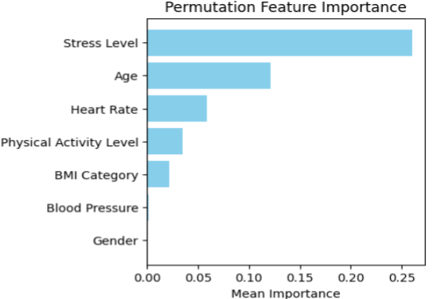  
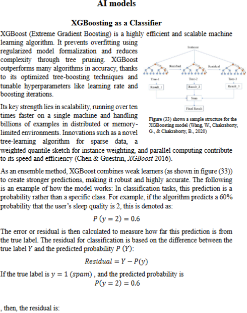  
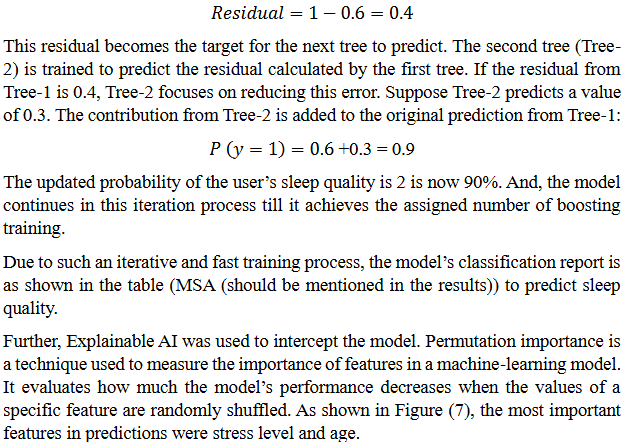  
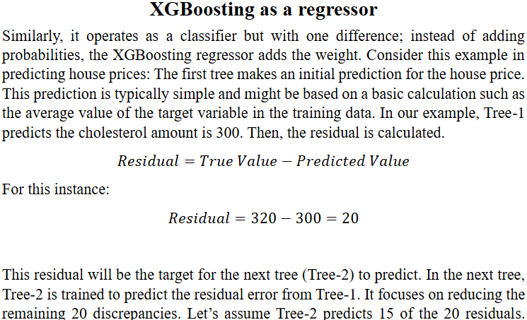

---

### 2025-07-03  
**Hours spent:** 6  
When most of the technical work was done, I went through the whole journal, README and other documents to make sure there are no typos, any missing bits. I copied all of the files to the GitHub and the project gallery with the photos and links was updated.

---

### 2025-07-04  
**Hours spent:** 6  
The finishing. I tidied up the codebase, and made clear comments, and gave one final full test of all hardware and software. To conclude on this test, I took the logs, screenshots, and system behaviour after an entire night simulation test.

---

## Images

### Expected results

### Analysis

