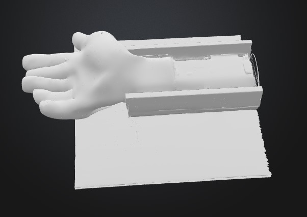

# Nocti-Care

Nocti-Care is a wearable smart sleep monitoring bracelet designed for underserved communities. It monitors stress, heart rate, motion, and temperature during sleep and sends this data wirelessly to a cloud server. A machine learning model then analyzes this data and sends personalized sleep improvement advice back to the user’s mobile app.

---

## Why This Project?

Poor sleep quality is a major contributor to long-term health issues. However, access to sleep clinics or high-end monitoring is not affordable for everyone. Nocti-Care aims to fill this gap using low-cost components and cloud-based AI.

---

## Features

- **Sensors**: GSR (stress), heart rate, gyroscope (motion), temperature  
- **Display**: OLED screen shows sleep status and alerts  
- **Connectivity**: ESP8266 module sends data to cloud  
- **Power**: Rechargeable Li-ion battery with safe charging module  
- **ML Integration**: Detects patterns of poor sleep or restlessness  
- **Mobile Interface**: User receives nightly sleep reports + tips

---

## Photos

-    
- 
- 
- 
- 
---

## Bill of Materials (BOM)

| # | Component                        | Description                             | Est. Price | Link |
|---|----------------------------------|-----------------------------------------|------------|------|
| 1 | Arduino Uno                      | Main microcontroller                    | $61        | [Link](https://store.arduino.cc/products/arduino-due) |
| 2 | GSR Sensor                       | Measures stress                         | $32        | [Link](https://www.amazon.eg/-/en/DIY-Kit-Skin-Electrical-Sensor-Sweat/dp/B0DC3XL3V6) |
| 3 | Heart Rate Sensor                | Pulse detection                         | $105       | [Link](https://www.amazon.com/Polar-Heart-Rate-Monitor-Women/dp/B07PM54P4N) |
| 4 | MPU6050                          | Gyroscope for motion detection          | $3         | [Link](https://www.ram-e-shop.com/ar/shop/kit-imu-mpu6050-gy521-imu-6-dof-mpu-6050) |
| 5 | ESP8266                          | Wi-Fi module                            | $3         | [Link](https://store.fut-electronics.com/products/wifi-serial-ttl-module) |
| 6 | Jumper Wires + Breadboard        | Prototyping                             | $16        | [Link](https://www.adafruit.com/product/239) |
| 7 | OLED Display (0.96”)             | Sleep data view                         | $11        | [Link](https://www.amazon.eg/dp/B09H19NKNW) |
| 8 | Real-Time Clock (DS1320)         | Time-stamp module                       | $7         | [Link](https://www.amazon.eg/dp/B091GQDMW1) |
| 9 | Micro SD Card Module             | Local data logging                      | $9         | N/A |
|10 | Li-ion Battery (3.7V 2200mAh)    | Power source                            | $12        | N/A |
|11 | Battery Charging Module (TP4056) | Safe charging                           | $4         | N/A |
|12 | Voltage Regulator (AMS1117)      | 3.3V for ESP                            | $12        | [Link](https://www.amazon.eg/dp/B0F41JNFVL) |
|13 | Buzzer Module                    | Audio feedback                          | $1         | N/A |
|14 | NTC Thermistor                   | Temperature sensor                      | $4         | N/A |

**Total Estimated Cost**: $280

---
### Note 
i can't provide for all the materials its links because this is what i found online and i am planning to buy it from the stores around me and it's cheaper, i am only asking to get my fund (reimbrusement) after you se my reciept.

